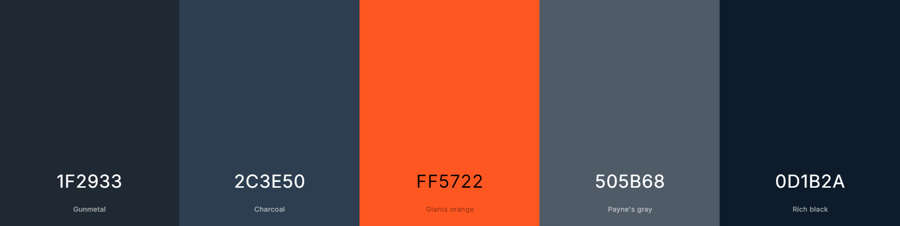

# *Frontgate*


## Description
Frontgate is a website designed to provide a brief and engaging overview of web development, with a focus on the core components of front-end development: HTML, CSS, and JavaScript. This site is aimed at individuals interested in learning the basics of web development and exploring whether front-end development is a good fit for them. This is the [Live Version](https://fairytaib.github.io/Frontgate/)


## Features

### Navbar
- Positioned at the top of the page.
- The navbar is fixed at the top, ensuring it remains visible to the user while scrolling.
- Includes a logo on the left and navigation links on the right.
- Links include:
  - **Home**: Leads to the homepage with an overview of web development.
  - **HTML, CSS, JavaScript**: Leads to pages covering each technology.
- Responsive design:
  - On smaller screens, navigation collapses into a hamburger menu.
  

  - On larger screens, it expands horizontally.
  
  

- **Hero Section**: Features a call-to-action link and a video background to engage users.
  

- **Overview Sections**: Answers the questions, "What is Front-End Development?" and "Who can become a Front-End Developer?" to give users context.
  
- **Card Feature**: This section includes visually appealing cards that provide quick navigation links to other pages of the website.
  
- **Contact Form**: Enables users to reach out to the enterprise, providing an effective channel for feedback and communication.
  
  
### HTML Page
- **Navbar**: Includes navigation links and a Call-to-Action (CTA) button, identical to the start page. The navbar is fixed at the top, ensuring it remains visible to the user while scrolling.
- **Hero Section**: Contains an HTML code example to give users a sense of HTML structure.

   
- **Overview Sections**: Answers questions such as "Why is HTML important in web development?" and "How do I write HTML?".

  

  This Part has a button included to give an example of vanilla HTML


  
- **Accordion Feature**: Provides expandable content for more detailed information.

  

  The Accordion opend look like this

  

- **Card Feature**: This section includes visually appealing cards that provide quick navigation links to other pages of the website.

  

- **Contact Form**: Enables users to reach out to the enterprise, providing an effective channel for feedback and communication.

  

### CSS Page
- **Navbar**: Includes navigation links and a Call-to-Action (CTA) button, identical to the start page. The navbar is fixed at the top, ensuring it remains visible to the user while scrolling.

- **Hero Section**: Displays a CSS code example to illustrate styling basics.

  

- **Overview Sections**: Covers "Why use CSS and what can it do?" and "How do I write CSS?".


- **Accordion Feature**: Expands with more detailed content on CSS.


The Accordion opend look like this


- **Card Feature**: This section includes visually appealing cards that provide quick navigation links to other pages of the website.

  

- **Contact Form**: Enables users to reach out to the enterprise, providing an effective channel for feedback and communication.

  

### JavaScript Page

- **Navbar**: Includes navigation links and a Call-to-Action (CTA) button, identical to the start page. The navbar is fixed at the top, ensuring it remains visible to the user while scrolling.

- **Hero Section**: Features a JavaScript example for introducing interactivity.

  

    When you click the button on the right side this window opens:

    

- **Overview Sections**: Explains "What is JavaScript used for in web development?" and "What do I need to know to start with JavaScript?".

  

- **Accordion Feature**: Contains expandable sections with more detail on JavaScript.

  

  The Accordion opend look like this

  

- **Card Feature**: This section includes visually appealing cards that provide quick navigation links to other pages of the website.

  

- **Contact Form**: Enables users to reach out to the enterprise, providing an effective channel for feedback and communication.

  

## User Stories

### First Time Visitors
* **As a first-time visitor**, I want to quickly understand the purpose of the website, so that I can decide if the content is relevant to me.
* **As a first-time visitor**, I want a simple and intuitive navigation system, so that I can easily explore the content without confusion.
* **As a first-time visitor**, I want to see engaging and visually appealing elements like a video background and clear CTAs, so that I feel encouraged to explore more about web development.

### Returning Visitors
* **As a returning visitor**, I want to easily access specific sections (like HTML, CSS, or JavaScript), so that I can focus on the area I’m currently learning.
* **As a returning visitor**, I want a clear and prominent sign-up button, so that I can explore opportunities for further education when I'm ready.

### Frequent Visitors
7. **As a frequent visitor**, I want to see updated content or new features added over time, so that I feel motivated to keep returning to the site.
8. **As a frequent visitor**, I want a responsive and consistently smooth experience on any device, so that I can use the site on both desktop and mobile.
9. **As a frequent visitor**, I want quick access to Call-to-Action buttons, so that I can take action without unnecessary steps.

## Design and User Experience
The design emphasizes a futuristic, technical aesthetic to resonate with the web development theme. Semantic HTML and a simple color scheme ensure clarity and focus, while a modern, futuristic font reinforces the theme. The overall layout and structure support easy navigation and a smooth user journey.

### Color Scheme



The design of the website incorporates the following color scheme to ensure a modern, visually appealing, and user-focused experience:

#### Colors Used

1. **Gunmetal (#1F2933)**: Used for the navbar and some background sections to provide a sleek, dark tone that conveys professionalism and modernity.
2. **Charcoal (#2C3E50)**: Utilized in main content sections to create a clear, unobtrusive background that allows text and visuals to stand out.
3. **Payne's Gray (#505B68)**: Employed as an accent background to create variation between sections while maintaining cohesion in the overall design.
4. **Rich Black (#0D1B2A)**: Applied in the footer to provide a strong, grounding element at the bottom of the page.
5. **Giants Orange (#FF5722)**: Exclusively used for Call-to-Action (CTA) buttons to draw attention and encourage user interaction.

This color scheme creates a balance between usability, aesthetics, and purpose, helping to engage users while guiding their attention toward key interactive elements like the CTA buttons.

### Typography

The typography of the website was chosen to enhance readability while maintaining a modern and futuristic design aesthetic. Two complementary fonts from Google Fonts were used:

#### Fonts
1. **Orbitron**:

  
   - Used for headings and titles across the website.
   - A futuristic, geometric font that aligns with the technical and modern theme of the site.
   - Creates a strong visual impact, drawing attention to important sections and maintaining a sleek aesthetic.
   

2. **Roboto**:

  
   - Used for body text and paragraph content.
   - A clean, sans-serif font that ensures high readability, even for long sections of text.
   - Complements Orbitron by providing a balance between modernity and legibility.

#### Font Usage
- **Headings**: Orbitron is used for all heading elements (`h1`, `h2`, `h3`, etc.), giving the site a consistent and bold structure.
- **Body Text**: Roboto is used for paragraphs, navigation links, and other textual content to ensure readability across devices.
- **Call-to-Action Buttons**: Both fonts are utilized strategically to make buttons and links stand out while staying consistent with the overall theme.

### Rationale
The combination of these fonts creates a futuristic and professional look while maintaining usability. The contrast between the bold headings and clean body text ensures that the content hierarchy is clear, helping users navigate the site effectively.

## Technologies Used
- **Languages**: HTML, CSS
- **Frameworks/Libraries**: Bootstrap CSS, Bootstrap JavaScript, Boxicons
- **Creation Tools**:
  - **Image Creation**: ChatGPT
  - **Logo Creation**: Boxicons
  - **Header Background Video**: pexels.com
- **Version Control**:
  - **Git**: Used for version control to track changes and manage the development process.
  - **GitHub**: Used as a cloud-based platform to store and share the code repository.
  - **Gitpod**: Used as an integrated development environment (IDE) to write and edit the code.
- **Tutorials Referenced**:
  - HTML Tags as Plain Text: [GeeksforGeeks](https://www.geeksforgeeks.org/how-to-display-html-tags-as-plain-text-in-html/)
  - Background Video Tutorial: [Kevin Powell - How to Create a Background Video](https://www.youtube.com/watch?v=RIDA6elhmBU)


## Deployment and Local Deployment

### Deployment to GitHub Pages
The site was deployed to GitHub Pages. Follow these steps to deploy the project yourself:

1. Navigate to the **Settings** tab in your GitHub repository.
2. Scroll down to the **Pages** section.
3. From the **Source** drop-down menu, select the `Main Branch` (or your default branch) and click "Save".
4. The page will automatically refresh, and you will see a ribbon at the top indicating the successful deployment.
5. You can now access your live site via the provided link.

The live link for this project can be found [here](https://fairytaib.github.io/Frontgate/).

---

### Local Deployment
If you wish to create a local copy of this project, follow these steps:

1. **Clone the Repository**:
  Open your terminal or command prompt, and type the following command:
    ```bash
    git clone https://github.com/fairytaib/Frontgate.git


## Testing
- **Browser Compatibility**

  The website was tested for functionality and responsiveness on the following browsers:  

  - **Opera GX**  

    
  - **Firefox**  

    
  - **Microsoft Edge** 

    

  All tests confirmed consistent performance and user experience across these platforms.

- **Responsiveness**: All buttons and links were tested for responsiveness on various screen sizes and devices.
- **Functionality Testing**
  All buttons and accordions on the website were thoroughly tested to ensure they function as intended. Each button performs its respective action correctly, and the accordions expand and collapse smoothly, displaying the appropriate content without any issues.

- **Validation**: The HTML and CSS have been validated using the W3C Validator to ensure compliance.
  - Index Page HTML Validation:

  
  In this case, no action is required as the use of multiple "h1" elements aligns with the design structure of the page. Each "h1" is contextually relevant, and accessibility tools handle them correctly in this implementation.

  - Index Page HTML Validation:

  

  - CSS Page HTML Validation:

  

  - Javascript Page HTML Validation:

  

  - CSS Validation:

  

- **Lighthouse Performance**: The website was evaluated using Google's Lighthouse extension and received the following performance ratings on all pages:

  - Performance: 90/100
  - Accessibility: 98/100
  - Best Practices: 100/100
  - SEO: 100/100

  

  ### Bugs Encountered

  - **Accordion Arrow Color Issue**:
    While customizing the Bootstrap accordion, I encountered an issue where the arrow color could not be changed using standard CSS. This was due to the use of an embedded SVG in Bootstrap for the arrow icons. 

    - **Solution**:  
    To resolve this, I modified the `fill` attribute of the SVG directly in the CSS to change the arrow color. This successfully applied the desired color to the accordion arrows.

  - ### General Observations
    No additional bugs or significant difficulties were encountered during the development process. The project proceeded smoothly, with all features working as intended.


  ### Mentoring and Tutor Feedback: 
  Design and functionality were reviewed by a mentor and a tutor for improvements.

## Disclaimer

- The contact information provided in the footer is not real and is included only as placeholder content for demonstration purposes.
- The reference to Code Institute is purely for educational and project purposes. Code Institute and its materials are copyright protected and are not affiliated with this project. All rights belong to their respective owners.


## Future Enhancements
Future improvements are not currently planned but will be considered based on user feedback.

## Author and Credits
**Author**: Sophjan Moubarrid

### Credits ###
**Images and Media**
- **DALL-E**: Image creation powered by [DALL-E](https://openai.com/dall-e).
- **Pexels**: Background video on the index page provided by [Pexels](https://www.pexels.com/).

**Design and Functionality**
- **Bootstrap**: CSS and JavaScript functionality provided by [Bootstrap](https://getbootstrap.com/).
- **Google Fonts**: Fonts used from [Google Fonts](https://fonts.google.com/).

**Content and Tutorials**
- **ChatGPT**: Text content generated by [ChatGPT](https://chat.openai.com/).
- **Kevin Powell**: Tutorial explanations available on [Kevin Powell's YouTube Channel](https://www.youtube.com/@KevinPowell).
- **Geeks for Geeks**: Explanation on using HTML tags as plain text from [Geeks for Geeks](https://www.geeksforgeeks.org/how-to-display-html-tags-as-plain-text-in-html/).

**Code Validation and Development Tools**
- **W3C**: Code validation conducted using [W3C](https://www.w3.org/).
- **Git**: Version control handled with [Git](https://git-scm.com/).
- **GitHub**: Cloud-based platform for storing and sharing code via [GitHub](https://github.com/).
- **Gitpod**: Online IDE for coding provided by [Gitpod](https://gitpod.io/).

**Mentoring and Guidance**
- **Iuliia Konovalova**: Mentoring and guidance by [Iuliia Konovalova](https://github.com/IuliiaKonovalova).

